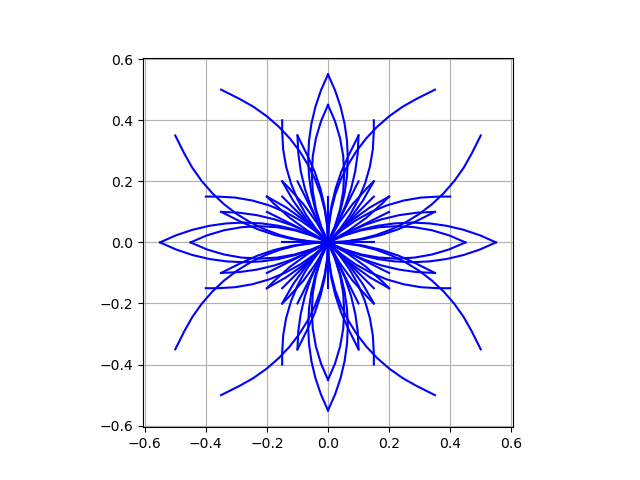
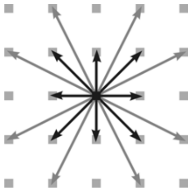

# Lattice Primitive Generator
## Contents

- **[About](#about)**
- **[Setup](#setup)**
- **[Usage](#usage)**
- **[Parameters](#parameters)**
- **[Output file structure](#output-file-structure)**
- **[How it Works](#how-it-works)**
</br>

## About
The scripts in this folder are used to generate the motion primitives for the state lattice planner. An example of the trajectories for a grid resolution of 5cm and turning radius of 0.5m is shown below.



## Setup
To install the required python packages run the following command

```
pip install -r requirements.txt
```

## Usage
Run the primitive generator by using the following command
```
python3 generate_motion_primitives.py [--config] [--output] [--visualizations]
```

To adjust the settings to fit your particular needs you can edit the parameters in the [config.json](config.json) file. Alternatively, you can create your own file and pass it in using the --config flag.

The output file can be specified by passing in a path with the --output flag. The default is set to save in a file called output.json in the same directory as this README.

The directory to save the visualizations can be specified by passing in a path with the --visualizations flag.

## Parameters ##
Note: None of these parameters have defaults. They all must be specified through the [config.json](config.json) file.

**motion_model** (string)
    
The type of motion model used. Accepted values:
- `ackermann`: Only forward and reversing trajectories
- `diff`: Forward moving trajectories + rotation in place by a single angular bin
- `omni`: Forward moving trajectories + rotation in place by a single angular bin + sideways sliding motions
</br>
</br>

**turning_radius** (float)

The minimum turning radius of the robot (in meters)
</br>
</br>

**grid_resolution** (float)

The resolution of the grid (in meters) used to create the lattice. If the grid resolution is too large for the turning radius then the generator will not return a good result. This is clearly seen in the 5cm resolution/2m turning radius sample.
</br>
</br>

**stopping_threshold** (float)

Number of consecutive iterations without a valid trajectory before stopping.
</br>
</br>

**num_of_headings** (float)

Number of discrete angular headings used. Restricted to multiples of 8 greater than or equal to 8. Angles are not generated uniformly but instead generated in a way to facilitate straight lines. See [angle discretization](#angle-discretization) for more details.
</br>
</br>

## Output file structure
The output file is a JSON file and contains the following fields:

**version**

The version number of the lattice generator that created the output file

**date_generated**

The date the output file was generated. Format: YYYY-MM-DD

**lattice_metadata**

A dictionary that contains information about the generated lattice. Most of this data comes from the config file used when generating the primitives. More information on each field is given in the [Parameters](#parameters) section. Includes the following fields:
- **motion_model**
- **turning_radius** (meters)
- **grid_resolution** (meters)
- **stopping_threshold**
- **num_of_headings**
- **heading_angles**
    - A list of the heading angles (in radians) that are used in the primitives
- **number_of_trajectories**
    - The total number of trajectories contained in the output file

**primitives**

A list of dictionaries where each dictionary represents an individual motion primitive. Each motion primitive contains the following fields:
- **trajectory_id**
    - The id associated with the primitive
- **start_angle_index**
    - The start angle of the primitive represented as an index for the heading_angle list given in the lattice_metadata
- **end_angle_index**
    - The end angle of the primitive represented as an index for the heading_angle list given in the lattice_metadata
- **left_turn**
    - A boolean value that is true if the path curves to the left. Straight paths default to true.
- **trajectory_radius** (meters)
    - The radius of the circle that was used to create the arc portion of a primitive. trajectory_radius is 0 if the primitive is purely a straight line
- **trajectory_length** (meters)
    - The length of the primitive
- **arc_length** (meters)
    - The length of the arc portion of a primitive. arc_length is 0 if the primitive is a straight line
- **straight_length** (meters)
    - The length of the straight line portion of a primitive. straight_length is 0 if the primitive is a pure arc.
- **poses**
    - A list where each entry is a list containing three values: x, y, and yaw (radians)

## How it works
This section describes how the various portions of the generation algorithm works.

### Angle Discretization
Dividing a full turn into uniform angular headings presents several problems. The biggest problem is that it will create angles for which a straight trajectory does not land nicely on an endpoint that aligns with the grid. Instead we discretize the angles in a way that ensures straight paths will land on endpoints aligned with the grid. 



The image shows how the angular headings are generated. The same idea can be extended to a higher number of headings. As a result, the number of headings parameter is restricted to multiples of 8 greater than or equal to 8.  

### Trajectory Generator
1. Create two lines. Line 1 passes through start point with angle of start angle, and line 2 passes through the end point with angle of end angle

2. Find the intersection point I of lines 1 and 2

3. Calculate the distance beween I and the origin (let this be d1). Also calculate the distance between I and the end point (let this be d2)

4. If d1 and d2 are equal then proceed to step 5. Otherwise, create intermediate points for each line that are min(d1, d2) distance away along the lines from I. So there should be an intermediate point on line 1 and an intermediate point on line 2. One of these intermediate points should align with either the origin or the end point by nature of how the distance was calculated.

5. Create perpindicular lines for each line that pass through the respective intermediate points. The intersection of these perpindicular lines is the centre of the circle whose arc represents the curved portion of the trajectory.

6. Finally, if needed append straight segments to the path to ensure we start at the origin and end at the end point.


There are several checks we need to make to ensure a valid trajectory is generated:
- If the start and end angles are parallel then the lines must overlap
- The intersection point must occur before the end point on line 2 and after the origin on line 1
- The radius of the generated trajectory must be less than the user supplied minimum turning radius

### Lattice Generator
The lattice generator follows closely the generation of the control set as described in [Generating Near Minimal Control Sets for Constrained Motion Planning in Discrete State Spaces](https://www.ri.cmu.edu/pub_files/pub4/pivtoraiko_mihail_2005_1/pivtoraiko_mihail_2005_1.pdf). A brief outline is given below:

1. All paths to states one unit from the origin are generated, then two units, and so on.

2. When a path is generated it is checked to ensure it does not pass close enough to another path. If it does it is removed, otherwise it remains in the set

    - Close is defined to be within 0.5 * grid resolution for length and 0.5 * average angular bin size for angular rotation

3. Steps 1-2 are continued until all trajectories at a certain distance are being removed. The generator will continue for a few more iterations untill N iterations have been completed with no new trajectories. At this point the generator terminates and returns the computed minimal set.

    - The number N is defined by the stopping_threshold parameter